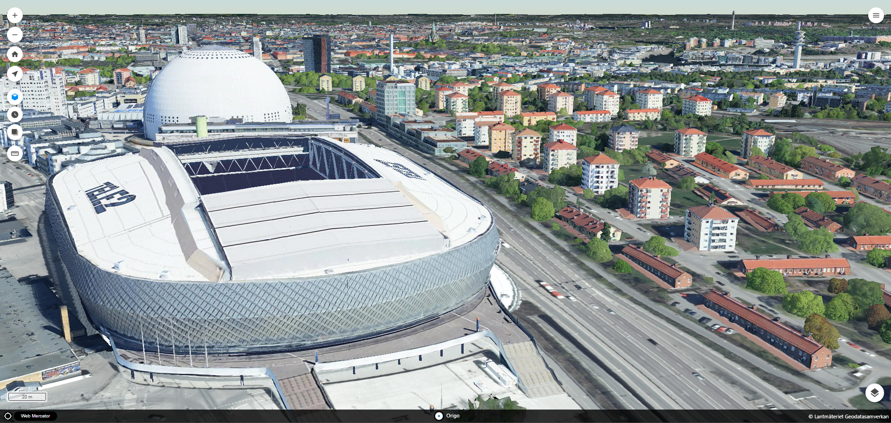

# Origo globe plugin
A plugin for [Origo map](https://github.com/origo-map/origo) to enable [CesiumJS](https://cesium.com/platform/cesiumjs/) globe using  [Ol-Cesium](https://openlayers.org/ol-cesium/)



## Setup
See [index_example.html](https://github.com/haninge-geodata/origo-globe-plugin/blob/main/index_example.html) and [index_example.json](https://github.com/haninge-geodata/origo-globe-plugin/blob/main/index_example.json) to get you started with configuration.

Copy files in build folder and put in Origos, plugins/globe folder.

ℹ️ Due to loading issues ol-cesium needs to be loaded from Origo-map.

Install ol-cesium
```
npm install olcs
```
In [origo.js](https://github.com/origo-map/origo/blob/master/origo.js) do

```
import OLCesium from 'olcs/OLCesium';

window.OLCesium = OLCesium;
```
